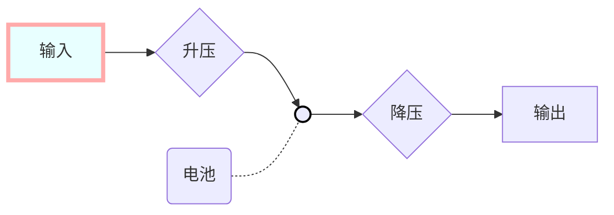

## 第二次讨论 &原型试验

2021.12.7

#### 完成

1.从充电宝到升压器到电池到降压器再给手机充电的流程，并用LED侦测有电

2.对室外太阳光照进行不完全测定（mV，mA）

#### 未完成

1.电池买得太大，电池盒放不下

2.充电电流可能过大

3.杜邦线承载电流小，需要更换电线

#### 计划中

1.作品命名、logo设计

2.外壳封装

3.与各类型电源输入可靠性测试

